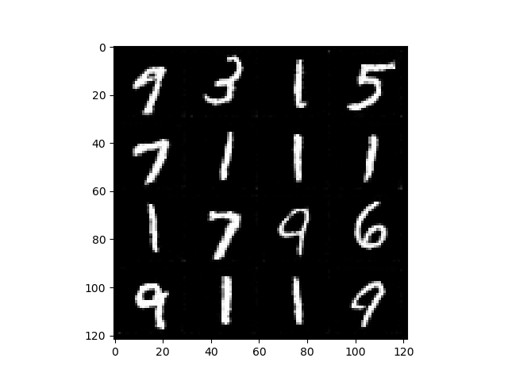
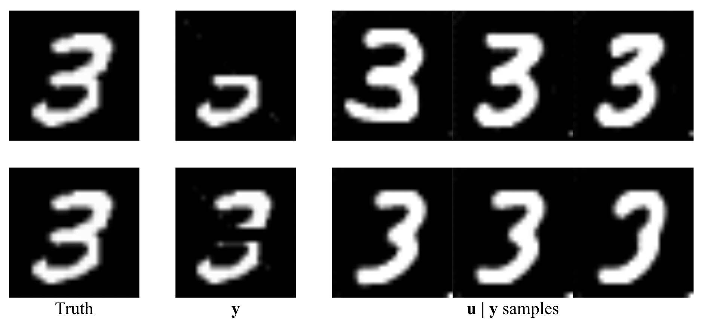

Experiments with score-based generative models and the MNIST dataset.

# Train 
```bash
python3 train.py --config configs/mnist.yml
```

Example (Samples from model):



# Inverse Problems
```bash
python3 mcmc.py --config configs/mcmc-mnist-half.yml
```

Example Inpainting Results:


